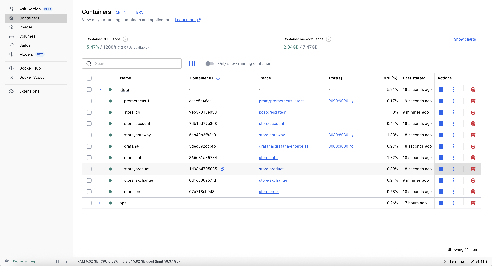
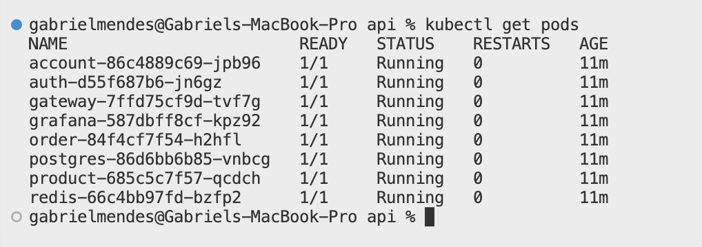

# Prometheus & Grafana

Implementamos uma solução de observabilidade no **Gateway Service** utilizando **Prometheus** e **Grafana** para monitorar métricas de todos os microserviços em tempo real.  
Em resumo:
- **Prometheus** coleta e armazena métricas (como uso de CPU, memória, latências, taxa de requisições) expostas pelos serviços via endpoints Actuator/metrics e Prometheus.
- **Grafana** consome esses dados para criar dashboards interativos, permitindo visualizar tendências, alertas e identificar gargalos (bottlenecks).

No nosso contexto, habilitamos o **Spring Boot Actuator** e o registro de métricas em Prometheus no *Gateway Service*. Assim, todas as rotas trafegam pelo gateway e suas métricas são expostas para coleta pelo Prometheus.

---

## Arquivos Modificados

### 1. `pom.xml` (Gateway Service)

Adicionamos as dependências para Actuator e Micrometer (prometheus):

```xml
<dependency>
    <groupId>org.springframework.boot</groupId>
    <artifactId>spring-boot-starter-actuator</artifactId>
</dependency>
<dependency>
    <groupId>io.micrometer</groupId>
    <artifactId>micrometer-registry-prometheus</artifactId>
    <scope>runtime</scope>
</dependency>
```

### 2. `docker-compose.yml`

Incluímos os serviços do Prometheus e Grafana:

```yaml
services:
  prometheus:
    image: prom/prometheus:latest
    hostname: prometheus
    ports:
      - 9090:9090
    volumes:
      - $VOLUME/prometheus/prometheus.yml:/etc/prometheus/prometheus.yml

  grafana:
    image: grafana/grafana-enterprise
    hostname: grafana
    ports:
      - 3000:3000
    environment:
      - GF_SECURITY_ADMIN_PASSWORD=admin
    volumes:
      - $VOLUME/grafana:/var/lib/grafana
      - $VOLUME/grafana/provisioning/datasources:/etc/grafana/provisioning/datasources
    depends_on:
      - prometheus
```

### 3. `application.yml` (Gateway Service)

Configuramos o Actuator e o endpoint de métricas para Prometheus:

```yaml
server:
  port: 8080

spring:
  application:
    name: gateway

  cloud:
    gateway:
      routes:
        - id: account
          uri: http://account:8080
          predicates:
            - Path=/account/**
        - id: auth
          uri: http://auth:8080
          predicates:
            - Path=/auth/**
        - id: exchange
          uri: http://exchange:80
          predicates:
            - Path=/exchange/**
        - id: product
          uri: http://product:8080
          predicates:
            - Path=/product/**
        - id: order
          uri: http://order:8080
          predicates:
            - Path=/order/**

logging:
  level:
    store: ${LOGGING_LEVEL_STORE:debug}

management:
  endpoint:
    gateway:
      enabled: true
  endpoints:
    web:
      base-path: /gateway/actuator
      exposure:
        include: ['prometheus', 'gateway']
```

Com essa configuração, o Gateway expõe métricas em `/gateway/actuator/prometheus`.

---

## Capturas de Tela

Abaixo, algumas evidências dos serviços em execução e do monitoramento:

- **Containers Docker rodando**  
  

- **Pods no Kubernetes (incluindo Redis e Grafana)**  
  

---

## Como Funciona

1. O Prometheus está configurado para “scrape” o endpoint `/gateway/actuator/prometheus` do serviço **gateway**.  
2. Todas as métricas (latências de rotas, contagem de requisições, status HTTP) são coletadas periodicamente.
3. O Grafana foi configurado para usar o Prometheus como fonte de dados, exibindo dashboards com gráficos de performance e alertas.

Dessa forma, conseguimos identificar eventuais **bottlenecks** (por exemplo, rota com alta latência ou uso elevado de CPU) e tomar ações pró-ativas.