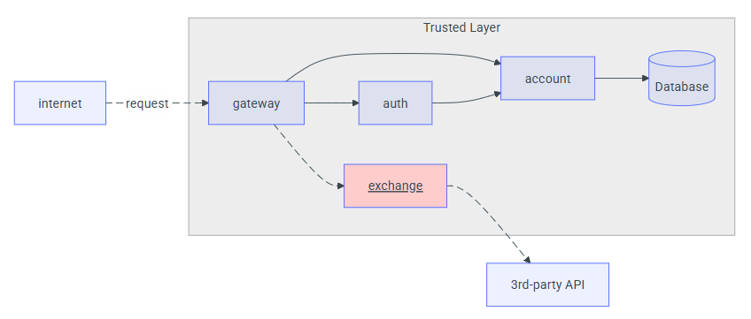
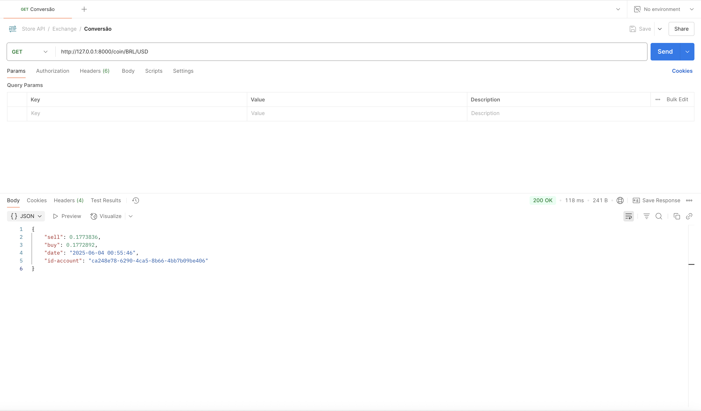

# Exchange API

A **Exchange API** foi desenvolvida em **FastAPI (Python)** para oferecer conversão de moeda via um endpoint REST.  
As cotações são obtidas em tempo real na [ExchangeRate-API](https://www.exchangerate-api.com).

---

## Endpoint

| Método | Rota                    | Descrição                                               |
| ------ | ----------------------- | ------------------------------------------------------- |
| `GET`  | `/exchange/{from}/{to}` | Converte da moeda **{from}** para **{to}** (ISO-4217). |

### Parâmetros de caminho

| Parâmetro | Exemplo | Descrição                              |
| --------- | ------- | -------------------------------------- |
| `from`    | `USD`   | Código ISO-4217 da moeda de origem     |
| `to`      | `EUR`   | Código ISO-4217 da moeda de destino    |

---

## Exemplo de resposta

```json
{
  "sell": 0.82,
  "buy" : 0.80,
  "date": "2021-09-01T14:23:42Z",
  "id-account": "0195ae95-5be7-7dd3-b35d-7a7d87c404fb"
}
```

- **sell**: taxa de venda (quanto a API vende 1 unidade de `from` em `to`).  
- **buy**: taxa de compra (quanto a API compra 1 unidade de `from` em `to`).  
- **date**: data e hora da cotação (formato ISO 8601).  
- **id-account**: identificador da conta que fez a requisição (UUID).  

---

#### Diagrama de Integração com Gateway



---

#### Teste da Rota com Postman

Abaixo segue um exemplo de requisição ao endpoint `/exchange/USD/EUR` no Postman, exibindo o retorno das taxas de câmbio:

