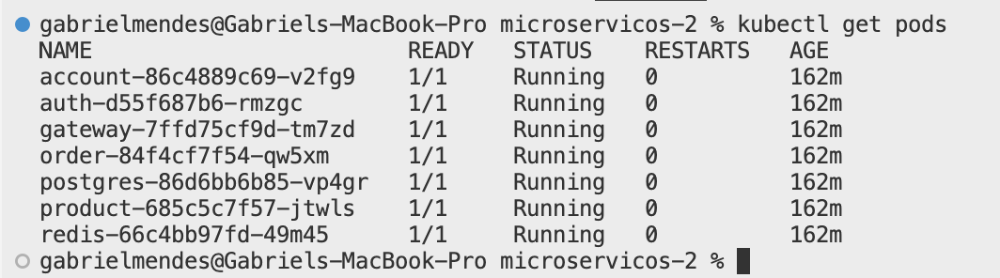
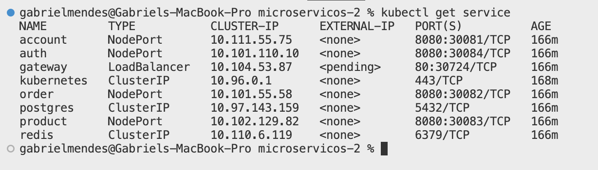

# MiniKube

## Objetivo

Este guia descreve como executar todos os microserviços em um cluster Kubernetes local usando o Minikube, simulando um ambiente de orquestração completo em sua máquina de desenvolvimento.

---

## Pré-Requisitos

- **Docker** instalado e em execução  
- **Minikube** instalado (versão recomendada: >= 1.0)  
- **kubectl** instalado e configurado para se comunicar com o Minikube  
- Privilegios de sudo (caso seja necessário para o uso de determinadas funcionalidades)

---

## Passos para Iniciar

### 1. Iniciar o Minikube

No terminal, execute:

```bash
minikube start --driver=docker
```

> O exemplo acima utiliza o driver Docker, mas você pode substituí-lo por outro (como “virtualbox” ou “hyperkit”) conforme sua configuração local. Para mais detalhes, consulte a [documentação oficial do Minikube](https://minikube.sigs.k8s.io/docs/).

Aguarde até que o Minikube faça o download da imagem base, inicie uma VM (ou container) e configure o cluster local.

---

### 2. Clonar e Navegar até o Projeto

```bash
# Exemplo de comando para clonar o repositório, se ainda não tiver feito:
git clone https://github.com/seu-usuario/seu-projeto.git
cd seu-projeto/platforma/api/k8s
```

No diretório `k8s/`, você encontrará arquivos YAML para cada microserviço:

- `account-service`
- `auth-service`
- `exchange-service`
- `gateway-service`
- `order-service`
- `product-service`
- `postgres-service`

---

### 3. Aplicar Todos os Manifests

Para criar todos os recursos de uma só vez, rode:

```bash
kubectl apply -f .
```

> Este comando processa todos os arquivos `.yaml` (ou `.yml`) do diretório atual, criando Deployments, Services, ConfigMaps, Secrets etc.

---

### 4. Verificar Status

#### 4.1. Pods

```bash
kubectl get pods
```
O retorno esperado deve ser semelhante a:

```
$ kubectl get pods
NAME                                READY   STATUS    RESTARTS   AGE
account-service-XXXXXXXXXX-XXXXX    1/1     Running   0          10m
auth-service-XXXXXXXXXX-XXXXX       1/1     Running   0          10m
...
postgres-service-XXXXXXXXXX-XXXXX   1/1     Running   0          10m
```



Verifique se todos os pods estão com o STATUS **Running** e sem erros. Caso algum esteja com STATUS **CrashLoopBackOff** ou **Error**, inspecione os logs:

```bash
kubectl logs <nome-do-pod>
```

#### 4.2. Serviços

```bash
kubectl get svc
```

Confira se cada serviço (Service) está exposto corretamente e possui o **Cluster-IP** ou **NodePort** configurado.

```
$ kubectl get svc
NAME               TYPE        CLUSTER-IP      EXTERNAL-IP   PORT(S)          AGE
account-service    ClusterIP   10.96.0.10      <none>        8080/TCP         10m
auth-service       ClusterIP   10.96.0.11      <none>        8080/TCP         10m
gateway-service    ClusterIP   10.96.0.12      <none>        80/TCP           10m
...
```
 


---

## Acessando a Aplicação

### 5. Acessar um Serviço via Navegador

Se quiser expor um serviço (por exemplo, o **gateway-service**) localmente, utilize:

```bash
minikube service gateway-service
```

O Minikube criará automaticamente um túnel temporário e abrirá o serviço no navegador. Caso não abra automaticamente, será exibido o URL que pode ser acessado manualmente.

> ⚠️ **Dica:** Em alguns sistemas, pode ser necessário usar `minikube tunnel` em outro terminal para expor serviços do tipo LoadBalancer.

---

## Arquitetura do Diretório `k8s/`

```
k8s/
├─ account-service.yaml
├─ auth-service.yaml
├─ configmap.yaml
├─ deployment.yaml
├─ gateway-service.yaml
├─ order-service.yaml
├─ product-service.yaml
├─ redis.yaml
├─ secrets.yaml
└─ service.yaml
```

- Cada microserviço contém um arquivo `k8s.yaml` que define o Deployment e o Service.
- O serviço do `postgres` possui ConfigMap, Secrets, Deployment e Service separados para maior flexibilidade.