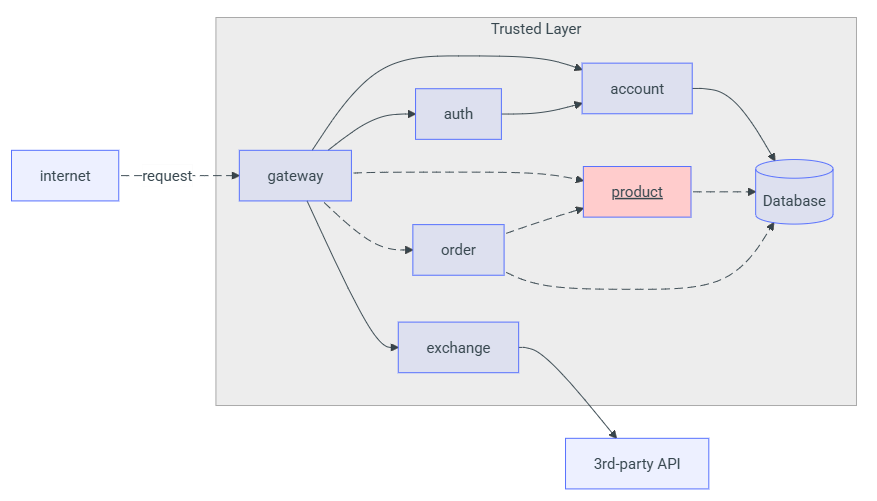
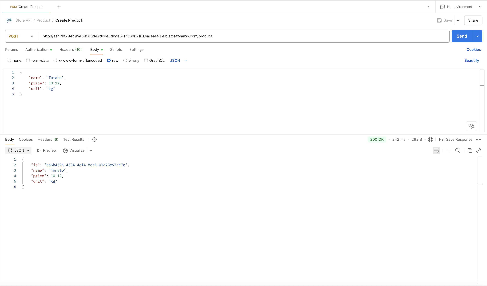
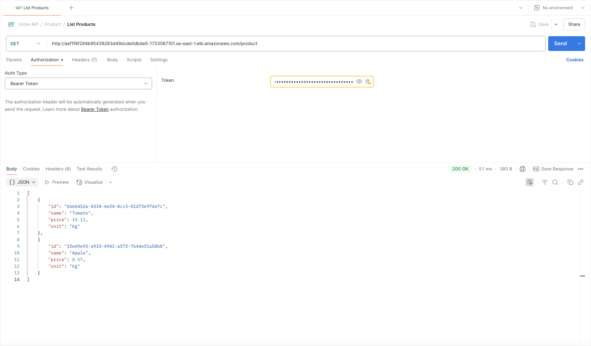
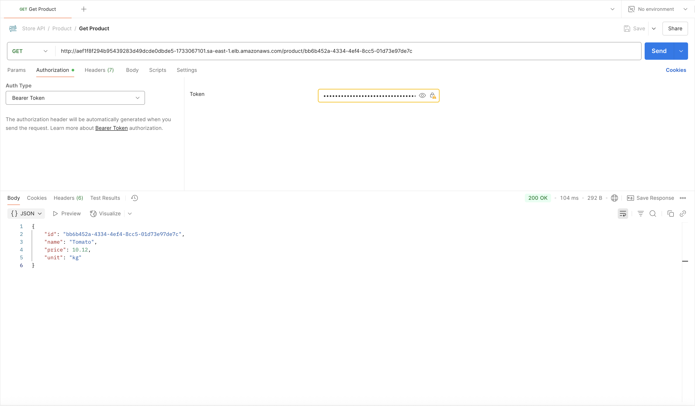
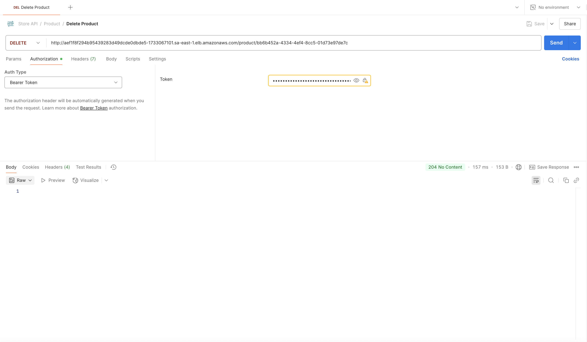

# Product API

A **Product API** foi desenvolvida em **Spring Boot (Java)** e fornece um conjunto de endpoints REST para gerenciar produtos de uma loja. Todas as requisições passam pelo **API Gateway**, que valida o token JWT antes de encaminhar ao serviço.

---

## Endpoints Principais

### Criar novo produto
- **Método:** `POST`  
- **Rota:** `/product`  
- **Headers:**
  ```http
  Authorization: Bearer <token-JWT>
  ```
- **Request Body** (JSON):
  ```json
  {
    "name": "Tomate",
    "price": 10.12,
    "unit": "kg"
  }
  ```
- **Response** (JSON — código HTTP 201 Created):
  ```json
  {
    "id": "0195abfb-7074-73a9-9d26-b4b9fbaab0a8",
    "name": "Tomate",
    "price": 10.12,
    "unit": "kg"
  }
  ```

---

### Listar todos os produtos
- **Método:** `GET`  
- **Rota:** `/product`  
- **Headers:**
  ```http
  Authorization: Bearer <token-JWT>
  ```
- **Response** (JSON Array — código HTTP 200 OK):
  ```json
  [
    {
      "id": "0195abfb-7074-73a9-9d26-b4b9fbaab0a8",
      "name": "Tomate",
      "price": 10.12,
      "unit": "kg"
    },
    {
      "id": "0195abfe-e416-7052-be3b-27cdaf12a984",
      "name": "Maçã",
      "price": 8.57,
      "unit": "kg"
    }
  ]
  ```

---

### Obter produto por ID
- **Método:** `GET`  
- **Rota:** `/product/{id}`  
- **Headers:**
  ```http
  Authorization: Bearer <token-JWT>
  ```
- **Response** (JSON — código HTTP 200 OK):
  ```json
  {
    "id": "0195abfb-7074-73a9-9d26-b4b9fbaab0a8",
    "name": "Tomate",
    "price": 10.12,
    "unit": "kg"
  }
  ```
  - Caso o produto não exista: retorna **404 Not Found** com corpo vazio.

---

### Deletar produto por ID
- **Método:** `DELETE`  
- **Rota:** `/product/{id}`  
- **Headers:**
  ```http
  Authorization: Bearer <token-JWT>
  ```
- **Response:**
  - **204 No Content** se o produto existir e for removido com sucesso.
  - **404 Not Found** se não encontrar o produto.

---

## Autenticação
- Todas as chamadas aos endpoints acima exigem um **token JWT** válido.  
- O token deve ser produzido pelo **Auth Service** e passado no cabeçalho:
  ```http
  Authorization: Bearer <token-JWT>
  ```

---

## Diagrama de Integração com o Gateway


---

## Testes das Rotas com Postman
A seguir exemplos de requisições no Postman para os principais fluxos:

- **Criação de um produto**  
  

- **Listagem de todos os produtos**  
  

- **Consulta de produto por ID**  
  

- **Remoção de produto por ID**  
  