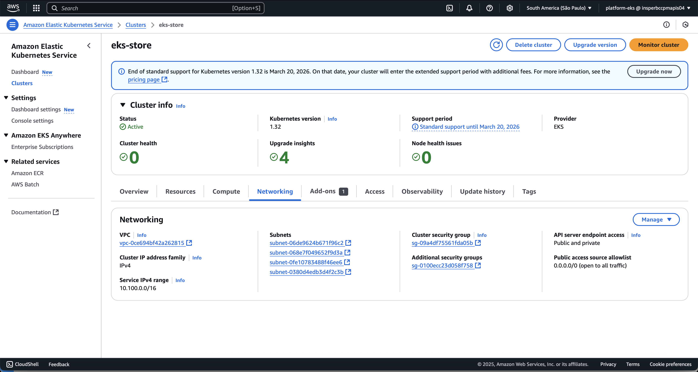
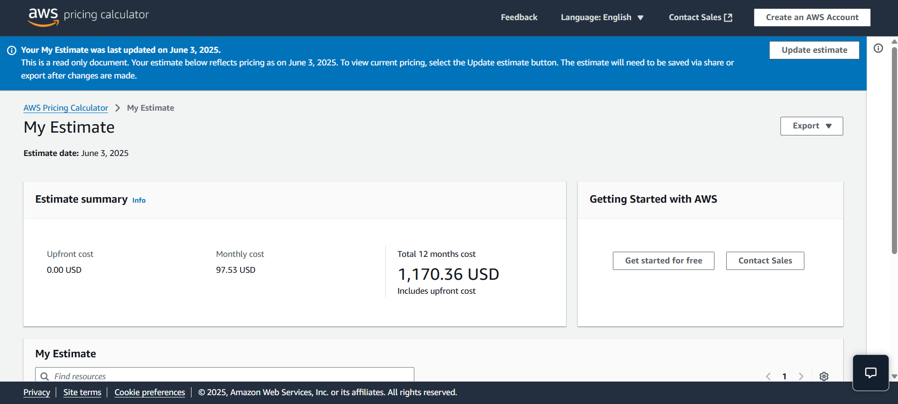

# Projeto em Grupo

## Visão Geral do Projeto

O projeto em grupo tem como objetivo aplicar práticas modernas de desenvolvimento em nuvem, DevOps e microserviços em um ambiente real de produção usando a AWS. As entregas foram organizadas em etapas práticas que abrangem desde a configuração da infraestrutura (AWS e EKS), testes de desempenho (HPA e carga), até o deploy automatizado com Jenkins (CI/CD). Além disso, cada grupo foi responsável por realizar uma análise de custos realista utilizando o AWS Pricing Calculator e calcular o uso de recursos com base em seu cluster. A entrega final inclui não apenas a implantação funcional da aplicação via EKS e banco de dados com RDS, mas também a documentação completa, uma apresentação de storytelling visual e um vídeo de demonstração entre 2 a 3 minutos. O projeto avalia tanto aspectos técnicos quanto de comunicação, destacando desafios enfrentados e práticas de engenharia adotadas, como o uso de PaaS, testes de carga e automatização de pipelines. Cada etapa do projeto contribui para uma formação sólida em arquitetura de sistemas distribuídos, cloud computing e entrega contínua.

## Objetivos

- Unificar os microserviços desenvolvidos individualmente.
- Usar autenticação centralizada (Auth).
- Implantar em Kubernetes local (Minikube) e remoto (AWS EKS).
- Implementar CI/CD com Jenkins.

## Arquitetura

- **API Gateway**: Controla entrada e roteamento.
- **Auth**: Serviço de autenticação com JWT.
- **Exchange, Product, Order, Account**: serviços de domínio.
- **PostgreSQL**: banco de dados usado pelos serviços.

## Fluxo de requisição

1. Login no Auth → recebe token JWT  
2. Token usado no Gateway para acessar rotas protegidas  
3. Gateway redireciona para Account, Order ou Product  

## Deploy

- **Minikube**: usado em testes locais  
- **EKS**: usado na apresentação final  

---

> Toda a infraestrutura foi gerenciada com `kubectl`, arquivos YAML e Helm quando aplicável.

---

## Configuração AWS e EKS

Durante este projeto, nós configuramos a conta AWS e provisionamos um cluster EKS. Abaixo, uma captura de tela do cluster em execução:

Este cluster foi configurado para escalar automaticamente conforme a demanda usando Auto Scaling Groups e HPA.

---

## Análise de Custos

Utilizamos o AWS Pricing Calculator para gerar um plano de custo que reflete o uso estimado dos recursos no EKS:

A projeção acima demonstra os custos mensais esperados para manter o ambiente dormindo e em uso.

---

## Vídeo de Demonstração

A seguir, nosso vídeo de demonstração, mostrando o projeto em funcionamento.  

  
*Clique na imagem acima para ver o vídeo.*